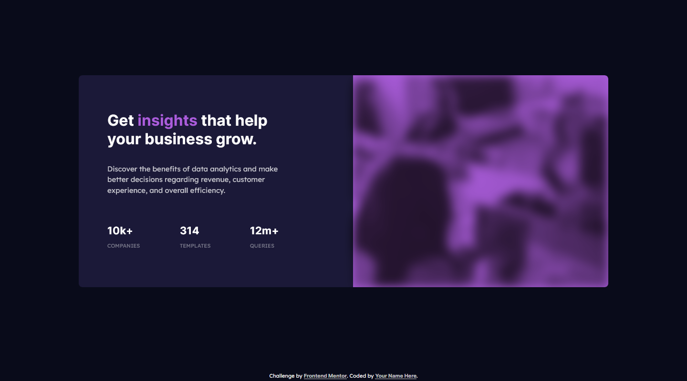
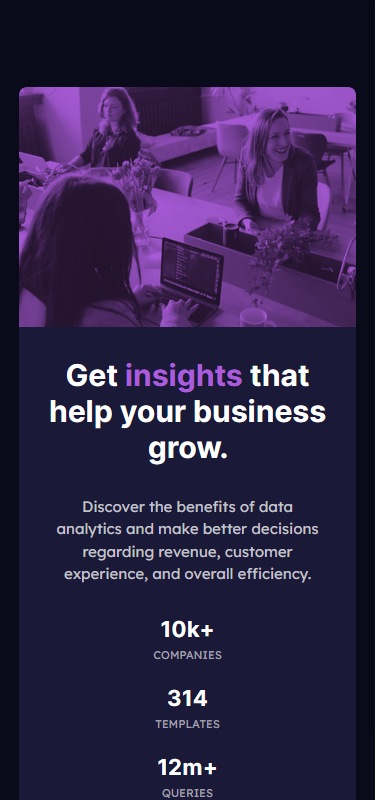

# Frontend Mentor - Stats preview card component solution

This is a solution to the [Stats preview card component challenge on Frontend Mentor](https://www.frontendmentor.io/challenges/stats-preview-card-component-8JqbgoU62). Frontend Mentor challenges help you improve your coding skills by building realistic projects. 

## Table of contents

- [Overview](#overview)
  - [Screenshot](#screenshot)
  - [Links](#links)
- [My process](#my-process)
  - [Built with](#built-with)
  - [What I learned](#what-i-learned)
  - [Useful resources](#useful-resources)
- [Author](#author)


## Overview


### Screenshot




### Links

- [Solution URL](https://github.com/samirhembrom/Frontend-Mentor---Stats-preview-card-component-solution)
- Live Site URL: [Add live site URL here](https://your-live-site-url.com)

## My process

### Built with

- Semantic HTML5 markup
- CSS custom properties
- Flexbox
- CSS Grid
- Mobile-first workflow

### What I learned

I used mix-blend-mode proeprty in css. It is used for bledning color of the element background.


```css
.container__img::before {
  content: '';
  background: url('images/image-header-mobile.jpg');
  background-size: cover;
  position: absolute;
  left: 0;
  top: 0;
  width: 100%;
  height: 100%;
  opacity: 0.8;
  mix-blend-mode: multiply;
}
```


### Useful resources

- [Example resource 1](https://css-tricks.com/almanac/properties/m/mix-blend-mode/) - This helped me for mix-blend-mode property.


## Author

- Frontend Mentor - [@samirhembrom007](https://www.frontendmentor.io/profile/samirhembrom007)
- Twitter - [@SamirHembrom11](https://twitter.com/SamirHembrom11)
